# Database of Rubik's Cube Algorithms

A collection of my favorite Rubik's Cube algorithms.

* [Notation](#Notation)
* [Algorithms](#Algorithms)
  * [2 Look OLL](#2-Look-OLL)
  * [2 Look PLL](#2-Look-PLL)
  * [Pocket Cube](#Pocket-Cube-2x2)
  * [Rubik's Cube Revenge](#Rubiks-Cube-Revenge-4x4)

## Notation

### Faces
* __F__ :point_right: Front
* __R__ :point_right: Right
* __B__ :point_right: Back
* __L__ :point_right: Left
* __U__ :point_right: Top (Up)
* __D__ :point_right: Bottom (Down)

### Middle Layers
* __M__ :point_right: Slice between __L__ & __R__ (Middle)
* __E__ :point_right: Slice between __U__ & __D__ (Equator)
* __S__ :point_right: Slice between __F__ & __B__ (Side)

### Cube Rotations
* __x__ :point_right: Rotate about __R__ face
* __y__ :point_right: Rotate about __U__ face
* __z__ :point_right: Rotate about __F__ face

A single letter implies a __clockwise__ turn of 90 degrees when viewed directly at the face. If it's followed by a prime, then it implies a __counter-clockwise__ turn. It it's followed by a __2__, then it implies a __half__ turn of 180 degrees.

A lowercase letter means you need to turn the middle layer along with the corresponding face so that two layers move.

### Examples
* __F2__ :point_right: Turn front face twice
* __D' R__ :point_right: Turn bottom face counter-clockwise, then the right face clockwise
* __x M R2__ :point_right: Turn cube so top face is towards you, then rotate the middle slice clockwise and the right face twice

## Algorithms

### 2 Look OLL
Orientation Last Layer

#### Edge Orientation
| Name | Image |  Algorithm |
|:----:|:-----:|:----------:|
| Opposite | 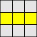 | __F (R U R' U') F'__ |
| Adjacent | 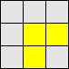 | __f (R U R' U') f'__ |
| None | 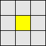 | __F (R U R' U') F' f (R U R' U') f'__ |

#### Corner Orientation
| Name | Image |  Algorithm |
|:----:|:-----:|:----------:|
| Sune | 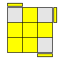 | __R U R' U R U2 R'__ |
| Anti-Sune | 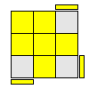 | __R' U' R U' R' U2 R__ |
| Car :car: | 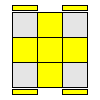 | __F (R U R' U')*3 F'__ |
| Blinker |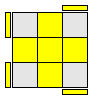 | __R U2 R2 U' R2 U' R2 U2 __ |
| Headlights | 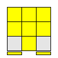 | __R2 D R' U2 R D' R' U2 R'__ |
| Chameleon | 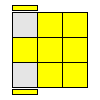 | __r U R' U' r F R F'__ |
| Bowtie :bowtie: | 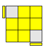 | __F' r U R' U' r' F R__ |

### 2 Look PLL
Permutation Last Layer

#### Corner Permutation
| Name | Image | Algorithm |
|:----:|:-----:|:---------:|
| CW Corner 3-Cycle | 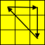 | __x R' U R' D2 R U' R' D2 R2__ |
| E-Perm            | 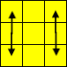 | __x' R U' R' D R U R' u2 R' U R D R' U' R__ |

#### Edge Permutation
| Name | Image | Algorithm |
|:----:|:-----:|:---------:|
| CW Edge 3-Cycle | 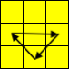 | __R2 U R U R' U' R' U' R' U R'__ |
| CCW Edge 3-Cycle | 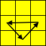 | __R U' R U R U R U' R' U' R2__ |
| H-Perm |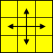 | __M2 U M2 U2 M2 U M2__ |
| Z-Perm | 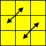 | __M2 U M2 U M' U2 M2 U2 M' U2__ |

### Blindfold
http://cubefreak.net/bld/3op_guide.php

| Name              | Algorithm                                             |
|:-----------------:|:-----------------------------------------------------:|
| Edge Orientation  | __M' U M' U M' U2 M U M U M U2__                      |
| CW Corner Orientation Pair | __R' D' R D R' D' R__                        |
| CCW Corner Orientation Pair | __R' D R D' R' D R__                        |
| CW Corner Orientation Triple | __(R' D' R D)*2__                          |
| CCW Corner Orientation Triple | __(R' D R D')*2__                         |
| Cycle Permutation | __R B' R F2 R' B R F2 R2__                            |

### Pocket Cube (2x2)

### Rubik's Cube Revenge (4x4)
| Name              | Algorithm                                             |
|:-----------------:|:-----------------------------------------------------:|
| OLL Parity        | __r U2 x r U2 r U2 r' U2 l U2 r' U2 r U2 r' U2 r'__   |
| PLL Parity        | __2R2 U2 2R2 u2 2R2 2U2__                             |
